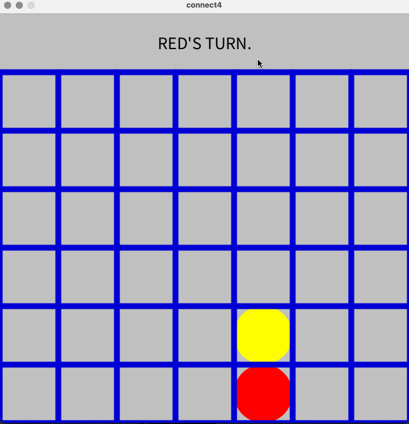

# connect-4
Welcome to the Connect4 Game! This project implements the classic Connect4 game using Python and Processing. The game allows human player to compete with computer on a visually engaging board, with features that ensure a seamless and fun experience.

## Features
* Interactive Graphics: Built using Processing for a vibrant and engaging user experience.
* Win Detection: Automatically detects when a player connects four pieces in a row (horizontally, vertically, or diagonally).

## How It Works
* Game Logic: The Python script handles the core game logic, including win detection, turn management, and move validation.
* Graphics: Processing is used to render the game board and manage player interaction through mouse clicks.

## Video Walkthrough
Here's a walkthrough of the game:

GIF made with LICEcap

## Software Prerequisites
- Python (version 3.7 or above)
- Processing IDE (for rendering the graphics)
- Python Mode in Processing:
    - Open the Processing IDE.
    - Go to "Tools" → "Add Tool".
    - Search for Python Mode and install it.
